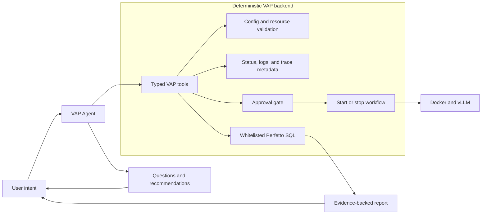
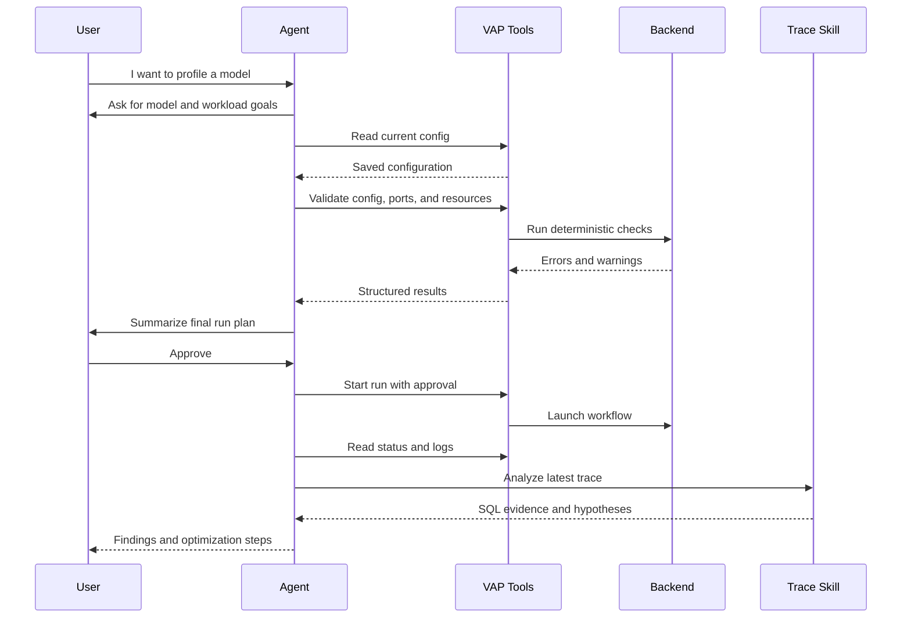
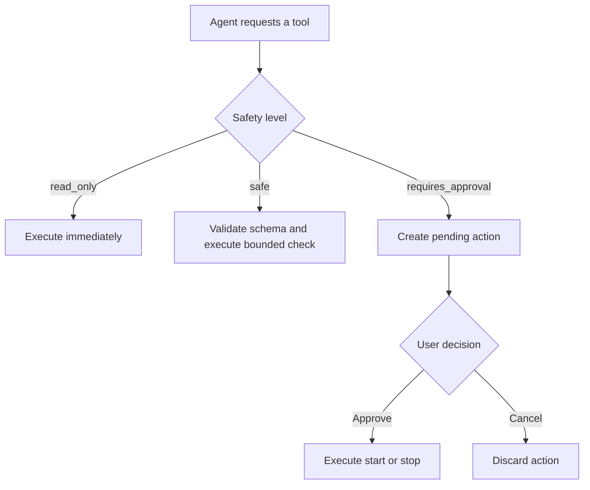
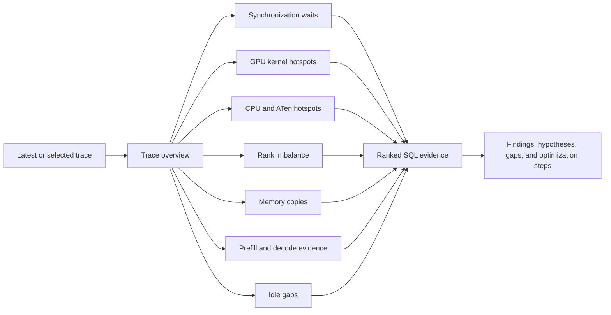
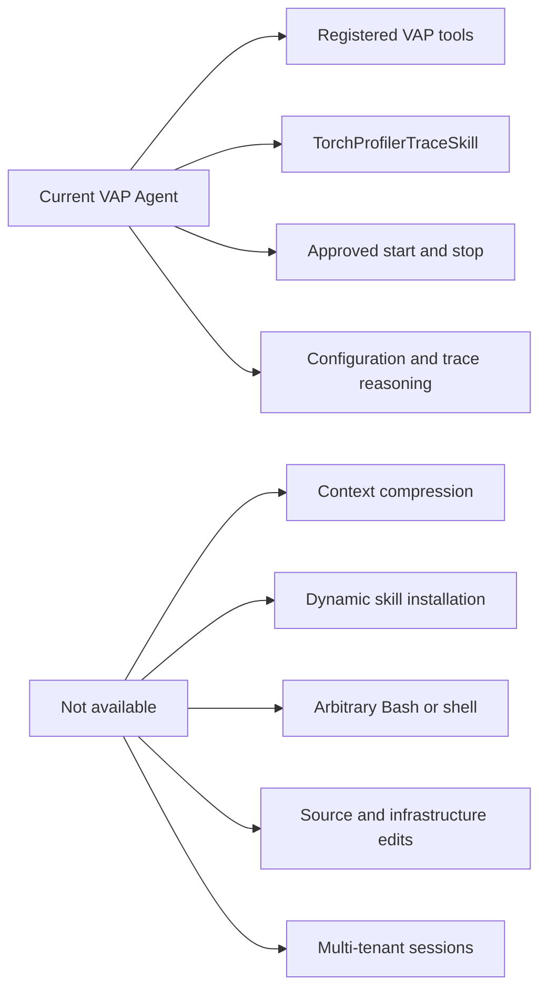

# VAP Agent and Skills

The VAP Agent is an optional reasoning and orchestration layer for vLLM
profiling. It helps users move from a profiling question to a validated run and
then from raw logs and traces to evidence-backed performance findings.

The Agent does not replace VAP's deterministic backend. Configuration
validation, resource checks, process control, Docker execution, file access, and
approval enforcement remain implemented in Python.

## Why VAP Includes an Agent

Profiling a model involves many related decisions:

- model and weight paths;
- Docker image, devices, mounts, and environment variables;
- tensor parallel size and memory limits;
- benchmark request shape, concurrency, and rate;
- profiler options and collection duration;
- log interpretation and trace analysis.

These decisions require context, but the underlying operations must remain
repeatable and controlled. The Agent provides the context-sensitive guidance;
VAP tools provide the controlled operations.

<div class="grid cards" markdown>

-   **Lower the learning curve**

    Users can describe the model and profiling goal instead of learning every
    configuration field before their first run.

-   **Catch problems before execution**

    The Agent checks configuration, ports, image availability, model paths,
    devices, and mounts before recommending a run.

-   **Turn artifacts into evidence**

    Logs, trace metadata, and Perfetto SQL results are summarized into findings,
    hypotheses, and next actions.

-   **Keep a human in control**

    Read operations can run automatically, while starting or stopping workloads
    requires explicit approval.

</div>

## Responsibility Boundary



The model can propose an action, but it cannot bypass schemas, validation,
approval, path restrictions, or process lifecycle controls.

## Typical Agent Workflow



## Agent Tools

Tools are typed backend capabilities exposed to the Agent. They are grouped by
their safety level.

### Read-only Tools

These tools inspect state without changing a process or configuration:

- `get_config`: read the saved VAP configuration;
- `get_run_status`: inspect the current run state;
- `read_log_file`: read an approved VAP log;
- `inspect_latest_trace`: inspect trace metadata and a bounded preview;
- `run_perfetto_sql`: execute one whitelisted Perfetto SQL preset;
- `run_torchprofiler_skill`: execute a structured trace-analysis workflow.

### Safe Tools

These tools perform bounded checks or prepare information:

- `validate_config`: run strict Pydantic and runtime validation;
- `check_ports`: check required and optional local ports;
- `check_resources`: check model paths, Docker image, devices, and mounts;
- `prepare_run`: determine whether a configuration is ready to run;
- `prepare_download_artifact`: create an approved download link for logs or
  trace artifacts.

### Approval-required Tools

These tools affect running processes:

- `start_run`: start the validated profiling workflow;
- `stop_run`: terminate the active workflow.

The Agent must return an approval request and wait for explicit user approval
before either tool is executed.



## Tools Versus Skills

A **tool** is a narrow operation with a typed schema, such as checking a port or
reading a log.

A **skill** is a versioned domain workflow that tells the Agent:

- which tools to call;
- in what order to call them;
- what evidence to collect;
- how to separate facts from hypotheses;
- what report contract to produce.

This separation keeps generic reasoning in the Agent while keeping VAP-specific
profiling knowledge reviewable in the repository.

## TorchProfilerTraceSkill

`TorchProfilerTraceSkill` is the current VAP analysis skill. It analyzes
PyTorch/vLLM traces using project-owned Perfetto SQL presets instead of sending
the complete raw trace to the LLM.



The standard workflow:

1. Selects the latest or requested trace.
2. Prefers a merged multi-rank trace when available.
3. Collects trace metadata and overview evidence.
4. Runs SQL presets for synchronization, kernels, operators, ranks, memory, and
   timeline gaps.
5. Separates confirmed evidence from possible explanations.
6. Recommends focused TensorBoard or Perfetto inspection.
7. Suggests concrete configuration or workload experiments.

The generated report contains:

- an executive summary;
- trace metadata;
- SQL-backed evidence;
- bottleneck hypotheses;
- optimization suggestions;
- evidence gaps and uncertainty;
- next inspection steps.

## Safety Design

The Agent is intentionally constrained:

- `start_run` and `stop_run` require approval;
- every tool call is validated against a JSON schema;
- configuration still passes the same backend validation used by the Web UI and
  CLI;
- `profiler_cfg.torch_profiler_dir` is immutable;
- Perfetto SQL is selected from a whitelist;
- raw trace content is not loaded into the LLM by default;
- file access is restricted to managed VAP paths and approved artifacts;
- tool rounds and completion tokens are bounded;
- the subscription key is stored only in the current server process;
- reports must distinguish evidence from hypotheses.

## Example Requests

Useful Agent requests include:

```text
Guide me through profiling Qwen/Qwen3-0.6B with two GPUs.
```

```text
Validate my current config and explain every warning before asking to run.
```

```text
Read the latest deployment and benchmark logs and explain why the run failed.
```

```text
Analyze the latest merged trace and produce a concise bottleneck report with SQL evidence.
```

```text
Compare the synchronization, kernel, and rank-imbalance evidence and suggest the next experiment.
```

## Configuration

Set the subscription key securely before starting VAP:

```bash
read -rsp "VAP subscription key: " VAP_LLM_SUBSCRIPTION_KEY
echo
export VAP_LLM_SUBSCRIPTION_KEY
vap start
```

Optional settings:

```bash
export VAP_LLM_BASE_URL="https://llm-api.amd.com/OpenAI"
export VAP_LLM_MODEL="gpt-5.6-sol"
export VAP_LLM_TIMEOUT_SEC=180
export VAP_AGENT_MAX_TOOL_ROUNDS=8
```

If no environment key is configured, the Agent page displays an unlock form.
The key is validated and retained only in process memory.

## Known Limitations and Intentional Boundaries

Some constraints are missing capabilities that may be improved later. Others are
intentional boundaries that prevent an LLM from bypassing VAP's safety model.



### No Context Compression

The Agent does not summarize or compact an older conversation. The browser sends
the selected message history back to the model for each request, and tool results
are appended during that request.

Impact:

- long sessions consume more of the model context window;
- old logs and tool results may crowd out newer details;
- the model may eventually lose early requirements or hit endpoint limits.

Current workaround:

- clear the chat before starting an unrelated profiling task;
- ask focused questions;
- request one broad `full_report` Skill run instead of many repetitive SQL calls;
- preserve important final settings in the VAP configuration rather than only in
  chat.

### Browser-side, Non-durable Conversation State

Conversation messages are stored by the Web UI, not as durable server-side Agent
memory. A server restart changes the session identifier and clears pending Agent
state. Pending approvals and an unlock key stored in process memory are also
lost.

The Agent therefore does not provide a durable knowledge base across servers,
users, or machines.

### Fixed Tool and Skill Registry

The model can reason about arbitrary text, but it can execute only the tools and
workflows registered by the VAP backend.

Currently:

- `TorchProfilerTraceSkill` is the only structured domain Skill;
- Perfetto SQL is limited to repository-owned presets;
- new Skills, queries, or tools require a code change and server restart;
- the Agent cannot search for, install, generate, or activate a Skill at runtime.

This keeps executable behavior reviewable, but limits coverage for new profiler
formats or specialized analyses.

### No Bash or General Command Execution

The Agent has no Bash, SSH, terminal, subprocess, package-manager, or arbitrary
Docker command tool. It cannot run commands such as `rocm-smi`, `docker ps`,
`ls`, or an ad-hoc Python script.

This is an intentional security boundary. A general shell would make prompt
injection or an incorrect model decision capable of affecting the host.

Current workaround:

- expose a narrowly scoped, typed, read-only VAP tool for a required diagnostic;
- run host diagnostics manually in a trusted terminal;
- keep mutating operations behind explicit approval.

### No Arbitrary File or Network Access

The Agent can read only approved VAP configuration, status, logs, and trace
artifacts. It cannot browse the host filesystem, read arbitrary secrets, or call
arbitrary network endpoints through a tool.

Download links are prepared through an allowlisted artifact tool instead of
letting the model invent paths.

### No Automatic Source or Infrastructure Changes

The Agent cannot:

- edit VAP source code;
- modify Docker or host configuration;
- install dependencies;
- change firewall rules;
- update systemd services;
- persist a proposed config over `~/.vap/config.json`.

An approved run uses a temporary configuration snapshot. Permanent configuration
changes remain a user-controlled UI or file operation.

### Bounded and Sequential Tool Execution

Tool execution is bounded by `VAP_AGENT_MAX_TOOL_ROUNDS`, which defaults to `8`.
Tools are processed sequentially inside the Agent loop.

A complex request may reach the round limit before completing, and independent
checks are not currently parallelized.

### Single-user and Single-run Design

The control server uses one process-level Agent runtime, one in-memory
subscription key, and one pending-action registry. VAP is intended for a trusted
single-user operations session, not a multi-tenant service.

The workflow also permits only one active profiling run at a time. Concurrent
start requests are rejected.

### No Distributed VAP Execution

Distributed configuration may be preserved for future compatibility, but VAP
currently warns and executes a local workflow. The Agent cannot coordinate
multi-node deployment, SSH workers, or Ray lifecycle management.

### No Dedicated Cross-run Comparison

The Agent can analyze the current or selected trace, but VAP does not maintain a
benchmark history database or provide a dedicated Skill for statistically
comparing several runs.

Users must currently retain artifacts and compare runs manually or add a
project-owned comparison workflow.

### Analysis Depends on Available Evidence

Agent conclusions are limited by the trace and logs:

- missing profiler events cannot be reconstructed;
- SQL correlation does not prove causality;
- rank or phase metadata may be absent;
- very large traces are intentionally not sent to the LLM;
- an unavailable Perfetto port requires manual trace download and import.

Reports must distinguish confirmed evidence, hypotheses, and evidence gaps.

### External LLM Dependency

Agent chat depends on the configured OpenAI-compatible endpoint, network
connectivity, model availability, and subscription key. Timeouts or provider
changes can make the Agent unavailable.

Core VAP configuration, CLI, Web UI, profiling, logs, trace fusion, TensorBoard,
and manual Perfetto analysis continue to work without the Agent.

## Potential Future Improvements

Possible improvements that preserve the safety model include:

- rolling context summaries with pinned configuration and approval state;
- per-user durable sessions and audit logs;
- a signed, reviewable Skill registry;
- more VAP-owned SQL and cross-run comparison Skills;
- parallel execution of independent read-only checks;
- a sandboxed allowlist of host diagnostics rather than unrestricted Bash;
- distributed deployment tools with explicit host and credential policies.

## Related Documentation

- [User Guide](user-guide.md)
- [Deployment and Technical Report](deployment.md)
- [TorchProfilerTraceSkill source](https://github.com/Shan2L/VAP/blob/main/skills/TorchProfilerTraceSkill/SKILL.md)
