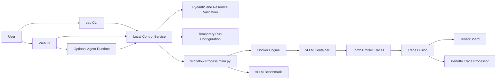
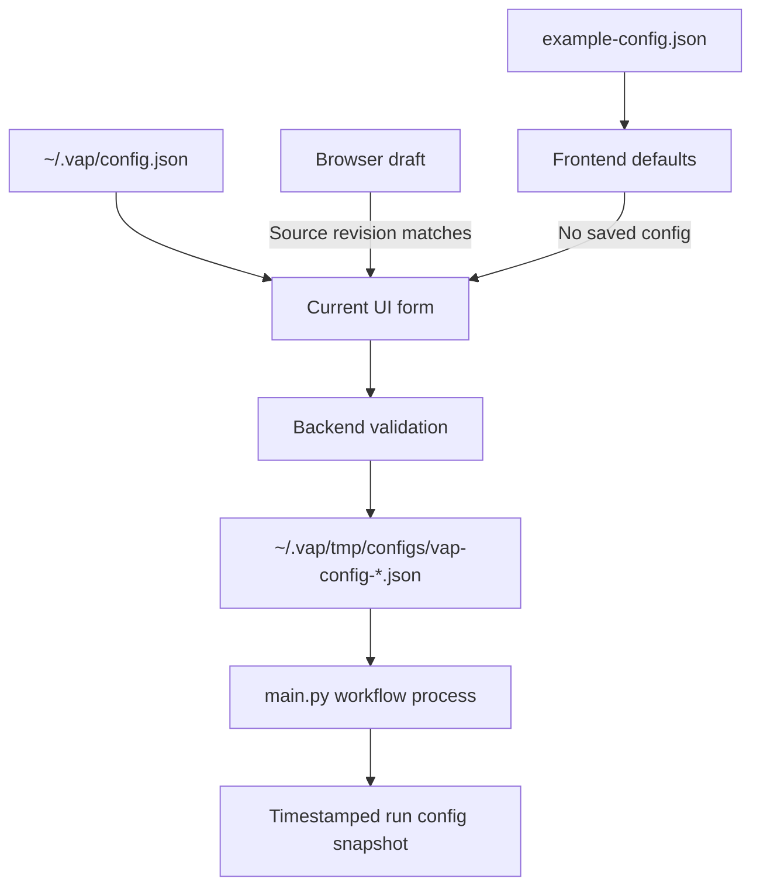
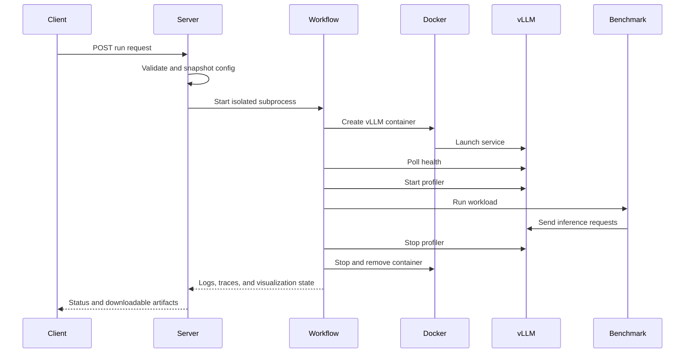
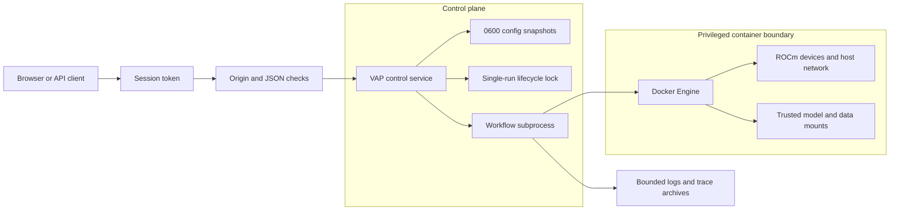

# VAP Deployment, Operations, and Technical Report

## 1. Purpose of This Document

This document is intended for personnel who deploy, operate, and maintain VAP. It covers:

- A production-ready local deployment approach;
- Commands for installation, upgrades, startup, operation, cleanup, and uninstallation;
- Configuration files and runtime artifacts;
- System architecture, execution flow, technology choices, and security design;
- Current limitations, troubleshooting guidance, and a production-readiness checklist.

VAP automates vLLM service deployment, benchmarking, Torch Profiler data collection, trace merging, and visualization with TensorBoard and Perfetto.

The current recommendation is to deploy VAP as a **local operations tool for trusted users**, with the service listening on `127.0.0.1` and remote access provided through an SSH tunnel. Do not expose it directly to the public internet.

---

## 2. System Architecture



Core components:

- `cli.py`: Provides the `vap start/run/clean/uninstall` commands.
- `server.py`: Implements the local HTTP control service, Web UI, authentication, run status management, and Agent tool registration.
- `public/index.html`: Provides configuration editing and validation, run controls, logs, and visualization entry points.
- `config.py`: Defines strict Pydantic configuration models.
- `validation.py`: Validates ports, parameters, security boundaries, and compatibility.
- `main.py`: Implements the Docker, vLLM, benchmark, profiler, and visualization workflow.
- `trace_fusion.py`: Merges multi-rank PyTorch traces.
- `agent_runtime.py`: Implements the optional LLM Agent and approval tools.
- `skills/TorchProfilerTraceSkill/`: Provides trace analysis capabilities based on Perfetto SQL.

---

## 3. Deployment Requirements

### 3.1 Supported Environment

The automated installer currently supports:

- Linux x86_64;
- Access to the Docker daemon;
- Access to the Docker image and model directories specified in the configuration;
- An AMD ROCm GPU environment;
- User permissions for the target devices and mount directories.

The installer installs the following components:

- A Python 3.12 virtual environment;
- A pinned version of `uv`, verified by SHA256 checksum;
- VAP Python dependencies;
- A pinned version of the Perfetto Trace Processor, verified by SHA256 checksum.

Bootstrap additionally requires `git`. The project installer requires `curl`, `install`, `mktemp`, `sha256sum`, `tar`, and `grep`.

### 3.2 Docker Checks

Before deployment, verify the following:

```bash
docker info
docker images
ls -l /dev/kfd /dev/dri/
```

VAP containers currently use host networking, host IPC, ROCm devices, `SYS_ADMIN`, `SYS_PTRACE`, and `seccomp=unconfined`. These settings are required for performance analysis; only trusted images, models, and configurations should be used.

### 3.3 Network Ports

Default or commonly used ports:

- VAP Web UI: `8899`
- vLLM: Configured by `vllm_deploy_cfg.--port`
- TensorBoard: Configured by `profiler_cfg.tensorboard_port`; default: `6006`
- Perfetto Trace Processor: Fixed at `9001`

---

## 4. Installation and Upgrades

### 4.1 Bootstrap Installation

```bash
curl -fsSL https://raw.githubusercontent.com/Shan2L/VAP/main/bootstrap.sh | bash
```

To install a specific branch or tag:

```bash
curl -fsSL https://raw.githubusercontent.com/Shan2L/VAP/main/bootstrap.sh \
  | VAP_REF=<branch-or-tag> bash
```

Bootstrap installs the managed source tree at:

```text
${XDG_DATA_HOME:-~/.local/share}/vap/source
```

It then executes the project's `install.sh`.

### 4.2 Installation from Source

```bash
git clone https://github.com/Shan2L/VAP.git
cd VAP
bash install.sh
```

### 4.3 Custom Installation Directories

For installation from source, set the runtime directory:

```bash
VAP_HOME=/path/to/vap-runtime bash install.sh
```

For Bootstrap installation, both the source and runtime directories can be set:

```bash
curl -fsSL https://raw.githubusercontent.com/Shan2L/VAP/main/bootstrap.sh \
  | VAP_HOME=/path/to/vap-runtime \
    VAP_SOURCE_DIR=/path/to/vap-source \
    bash
```

The default runtime directory is `~/.vap`, and the command entry point is `~/.local/bin/vap`.

Ensure that the command directory is included in `PATH`:

```bash
export PATH="$HOME/.local/bin:$PATH"
```

### 4.4 Installation Verification

```bash
vap --help
vap start --help
vap uninstall --help
```

### 4.5 Upgrades

For a Bootstrap installation, rerun the installation command:

```bash
curl -fsSL https://raw.githubusercontent.com/Shan2L/VAP/main/bootstrap.sh | bash
```

For an installation from source, update the code and rerun the installer:

```bash
git pull
bash install.sh
```

Upgrades preserve the existing `~/.vap/config.json` and run logs.

---

## 5. Configuration Management

### 5.1 Configuration Sources

VAP uses the following configuration precedence:

1. `example-config.json`: The sole default configuration template;
2. `~/.vap/config.json`: The user's current configuration, which overrides the default template when present;
3. A browser localStorage draft: Restored only when its source file and revision match;
4. A temporary configuration generated when a task is started from the UI: Stored in `~/.vap/tmp/configs/`;
5. `vap run --config`: A configuration explicitly specified through the CLI.

After `example-config.json` is modified, the frontend retrieves the latest defaults through `/api/config?source=example`. Existing browser drafts are automatically invalidated when the source file changes.

### 5.2 Primary Configuration Sections

`model_cfg`

- `model_name`: Model name or relative model path.
- `model_path`: Root model directory on the host.

`vllm_deploy_cfg`

- vLLM Serve parameters.
- `--host` and `--port` must match the benchmark configuration.
- `--trust-remote-code` triggers a security warning.

`vllm_bench_cfg`

- `vllm bench serve` parameters.
- Includes the endpoint, dataset, input and output lengths, concurrency, and request rate.

`profiler_cfg`

- Torch Profiler enablement and collection parameters.
- `torch_profiler_dir` is fixed at `/app/VAP/log/vllm-profile`.
- `tensorboard_port` configures the TensorBoard port.

`container_cfg`

- Docker image name and tag;
- GPU devices;
- Host mounts;
- Environment variables.

`distributed_cfg`

- Currently reserved for future distributed support;
- Displays a yellow warning at this stage;
- Ray ports and remote nodes are not used;
- VAP continues to run in local, single-host mode.

### 5.3 Configuration Validation

Before a run, VAP checks:

- The Pydantic model structure;
- Required and unknown fields;
- Port ranges and availability;
- Consistency of deployment and benchmark hosts and ports;
- The Docker image, model directories, devices, and mount paths;
- Tensor parallelism against the number of visible GPUs;
- Shell-unsafe characters;
- The fixed profiler directory;
- Privileged container settings and the `--trust-remote-code` warning.

---

## 6. Usage

### 6.1 Starting the Web UI

```bash
vap start
```

This is equivalent to:

```bash
vap start --host 0.0.0.0 --port 8899
```

After startup, the service prints local, hostname, and IP candidates containing
the same per-process startup token:

```text
VAP session URL candidates:
  Local: http://127.0.0.1:8899/?token=...
  Network candidate: http://vap-host:8899/?token=...
  Network candidate: http://10.0.0.8:8899/?token=...
```

After the first access, the token is stored in a `SameSite=Strict` cookie and removed from the browser's address bar.
The hostname/IP entries are candidates rather than a remote-reachability
guarantee. Access still depends on DNS or routing and a firewall rule allowing
`8899/tcp`.

### 6.2 Remote Access

To install, start, and tunnel VAP in one command, replace `{user}` and
`{hostname}` and run locally:

```bash
ssh -t -L 8899:127.0.0.1:8899 {user}@{hostname} \
  'curl -fsSL https://raw.githubusercontent.com/Shan2L/VAP/main/bootstrap.sh | bash && exec ~/.local/bin/vap start --host 127.0.0.1'
```

The remote service remains bound to loopback. The local browser can use the
tokenized URL printed in the SSH session because the command forwards remote
port `8899` to local port `8899`. Keep the session open; `Ctrl-C` stops VAP and
closes the tunnel.

For an existing installation, keep VAP bound to the loopback address, start it
on the remote host, and create the tunnel separately:

```bash
ssh -L 8899:127.0.0.1:8899 user@vap-host
```

Then open the URL printed by VAP in a local browser.

The default command exposes VAP on every network interface:

```bash
vap start
```

This is convenient on a trusted network, but VAP does not provide TLS and must
not be used as a substitute for a production authentication gateway. For
untrusted or production networks, explicitly use `--host 127.0.0.1` with an SSH
tunnel or controlled reverse proxy.

### 6.3 Web UI Workflow

1. Open the tokenized URL from the startup log.
2. Review or modify the model, image, GPU, mount, vLLM, and profiler configuration.
3. Click Validate.
4. Review the port, resource, and backend validation results.
5. Acknowledge any yellow warnings.
6. Click Run and confirm execution.
7. Review `vap_log.txt`, the deployment log, and the benchmark log.
8. After the run completes, open TensorBoard or Perfetto.
9. Download the profile trace archive.

When Run is selected, the UI does not overwrite `~/.vap/config.json`; instead, it creates a temporary configuration with `0600` permissions.

### 6.4 Running from the CLI

```bash
vap run \
  --config ~/.vap/config.json \
  --visualization-host 127.0.0.1
```

The CLI executes the complete workflow and starts the visualization processes after the benchmark completes.

### 6.5 Agent Functionality

The Agent is optional. Set the following variables before startup:

```bash
export VAP_LLM_SUBSCRIPTION_KEY="..."
export VAP_LLM_BASE_URL="https://llm-api.amd.com/OpenAI"
export VAP_LLM_MODEL="gpt-5.6-sol"
export VAP_AGENT_MAX_TOOL_ROUNDS=8
vap start
```

The Agent can read configurations, logs, run status, and trace-analysis results. Mutating operations, such as starting or stopping a task, require user approval.

### 6.6 Cleaning Logs

```bash
vap clean
```

The VAP log directory can also be specified explicitly:

```bash
vap clean --logs-dir ~/.vap/logs
```

The cleanup function refuses to delete any directory that does not belong to VAP.

### 6.7 Uninstallation

By default, uninstallation preserves configurations and logs:

```bash
vap uninstall
```

To delete all runtime data:

```bash
vap uninstall --purge
```

To also remove the Bootstrap-managed source tree:

```bash
vap uninstall --purge --remove-source
```

For non-interactive environments:

```bash
vap uninstall --purge --remove-source --yes
```

VAP must be stopped before uninstallation.

---

## 7. Optional systemd User Service

On a dedicated workstation, the Web UI can be managed with a systemd user service.

Create `~/.config/systemd/user/vap.service`:

```ini
[Unit]
Description=VAP local profiling control service
After=network-online.target

[Service]
Type=simple
Environment=VAP_HOME=%h/.vap
ExecStart=%h/.local/bin/vap start --host 127.0.0.1 --port 8899
Restart=on-failure
RestartSec=3

[Install]
WantedBy=default.target
```

Enable the service:

```bash
systemctl --user daemon-reload
systemctl --user enable --now vap
systemctl --user status vap
```

View the startup token:

```bash
journalctl --user -u vap -n 50 --no-pager
```

To keep the service running after the user logs out:

```bash
loginctl enable-linger "$USER"
```

This command may require administrator privileges.

---

## 8. Runtime Artifacts

Default run root directory:

```text
~/.vap/logs/<YYYYMMDD_HHMMSS>/
```

Common files:

- `config.json`: A copy of the configuration for this run;
- `vap_log.txt`: VAP workflow log;
- `vllm_deploy.log`: vLLM startup log;
- `vllm_bench.log`: Benchmark log;
- `vllm-profile/`: Raw profiler data;
- `*-merged_trace.json.gz`: Merged multi-rank trace output;
- `visualization_pids.json`: Visualization process IDs.

Temporary configurations:

```text
~/.vap/tmp/configs/
```

Tools and caches:

```text
~/.vap/bin/
~/.vap/cache/
~/.vap/perfetto-home/
~/.vap/venv/
```

---

## 9. Technical Report

### 9.1 Technical Objectives

VAP addresses the following needs:

- Integrates vLLM deployment, benchmarking, and profiling into a repeatable workflow;
- Reduces the effort required to configure Torch Profiler and locate traces;
- Provides pre-run validation for ports, paths, devices, and Docker parameters;
- Supports different operating scenarios through both a Web UI and CLI;
- Archives run logs and configurations in separate directories to improve traceability;
- Provides entry points for analysis with TensorBoard, Perfetto, and the optional Agent.

### 9.2 Technology Choices

Python 3.12

- Used for the control plane and workflow implementation;
- Its standard library provides HTTP, process, file, and archive capabilities.

Pydantic

- Strict configuration models;
- Unknown fields are prohibited;
- Structural errors are detected before execution.

Docker SDK for Python

- Creates and manages vLLM containers;
- Explicitly configures devices, mounts, IPC, networking, capabilities, and environment variables.

Native Web SPA

- Implemented as the single file `public/index.html`;
- Requires no additional frontend build tools;
- Reduces deployment dependencies and static-asset complexity.

Torch TensorBoard Profiler

- Displays PyTorch Profiler traces;
- Supports operator, kernel, and timeline analysis.

Perfetto Trace Processor

- Provides trace SQL queries;
- Supports timeline analysis in conjunction with the Perfetto Web UI.

OpenAI-Compatible Agent

- Optionally integrates with the AMD OpenAI-compatible API;
- Decouples tool invocation from LLM inference;
- Mutating operations require explicit approval.

### 9.3 Configuration Data Flow



This design prevents the Web UI from directly overwriting the user's configuration while ensuring that every run has an independent configuration snapshot.

### 9.4 Execution Flow

1. The Server receives a run request and performs backend validation.
2. The Server creates a temporary configuration with `0600` permissions.
3. The Server starts an independent Workflow subprocess.
4. The Workflow creates the run log directory and copies the configuration.
5. The Workflow checks ports, the model, the image, and devices.
6. The Docker SDK starts the vLLM container.
7. The Workflow polls the vLLM `/health` endpoint.
8. The Workflow calls `/start_profile`.
9. `vllm bench serve` runs inside the container.
10. The Workflow calls `/stop_profile` from a `finally` block.
11. The Workflow stops and removes the container.
12. Trace Fusion merges traces from multiple ranks.
13. TensorBoard and the Perfetto Trace Processor are started.



### 9.5 Security Model

HTTP control plane:

- A random token is generated each time the Server starts;
- A query-string token is accepted only on the root path;
- A `SameSite=Strict` cookie is used after authentication;
- Mutating requests must use JSON;
- Same-origin `Origin` checks are enforced;
- The service listens on `0.0.0.0` by default and prints a warning because it
  does not provide TLS;
- Operators can pass `--host 127.0.0.1` for loopback-only deployments.

Configuration and commands:

- Pydantic uses `extra=forbid`;
- CLI parameters undergo shell-safety validation;
- `shlex` is used to construct fixed commands;
- Model, device, and mount paths are checked;
- The profiler output directory is fixed;
- Warnings are displayed for privileged settings and `--trust-remote-code`.

File system:

- `VAP_HOME` and temporary configuration directories use `0700` permissions;
- Configuration files use `0600` permissions;
- Symbolic links are skipped during archiving;
- Archives are subject to limits on file count and total size;
- Cleanup and uninstallation reject dangerous paths.

Supply chain:

- The installer pins the `uv` and Perfetto versions;
- Downloaded content is verified with SHA256 checksums;
- Bootstrap refuses to overwrite an unrecognized source directory or one with local modifications.



### 9.6 Lifecycle and Failure Handling

- If the benchmark fails, VAP still attempts to stop the profiler;
- The Docker container is stopped and removed when the workflow ends;
- Visualization process IDs are written to a PID file, and the processes are reaped on exit;
- The Server uses a single-run lock to prevent concurrent starts;
- A stop request issued during startup can be recorded and processed subsequently;
- Temporary configurations are cleaned up according to the retention policy.

### 9.7 Test Status

The repository currently uses `unittest`:

```bash
cd VAP
uv run python -m unittest discover -s tests -v
```

Current test coverage includes:

- Configuration security and Pydantic behavior;
- The distributed-mode warning;
- CLI argument quoting;
- Private-directory permissions;
- Cleanup boundaries;
- Web tokens, cookies, same-origin enforcement, and concurrent startup;
- Profiler shutdown after an error;
- CLI uninstallation argument forwarding;
- Trace Fusion;
- The Agent Skill schema.

At the time of writing, all 26 tests pass.

---

## 10. Known Limitations

- The automated installer supports only Linux x86_64.
- Distributed execution is not yet implemented. `distributed_cfg` only displays a warning, and execution proceeds in local mode.
- VAP uses a privileged Docker configuration and must not run untrusted images or models.
- `--trust-remote-code` executes code from the model repository.
- The Web Server does not provide TLS and must not be exposed directly to the public internet.
- The Perfetto Trace Processor uses the fixed port `9001`.
- Merging very large traces can consume substantial memory.
- In CLI mode, the main process continues running while the visualization processes remain active.
- Kubernetes, Docker Compose, and multi-tenant deployment are not currently provided.

---

## 11. Common Troubleshooting Procedures

### `vap: command not found`

```bash
export PATH="$HOME/.local/bin:$PATH"
```

Verify:

```bash
ls -l ~/.local/bin/vap
```

### Cannot Connect to Docker

```bash
docker info
```

Verify that the current user has Docker permissions and that the Docker daemon is running correctly.

### Model Directory Does Not Exist

Verify:

```bash
ls -ld <model_root>
ls -ld <model_root>/<model_name>
```

### GPU Is Not Visible

```bash
ls -l /dev/kfd /dev/dri/
```

Check `container_cfg.devices`, the user's group memberships, and Docker permissions.

### Port Is Already in Use

```bash
ss -ltnp | grep -E ':(8899|8080|6006|9001)\b'
```

Update the corresponding configuration or stop the conflicting process.

### Frontend Does Not Load the Latest Configuration

1. Click Reload.
2. Verify the path returned by `/api/config?source=current`.
3. Check whether `~/.vap/config.json` overrides the example configuration.
4. Force-refresh the browser.
5. Restart the VAP Server.

### Trace Cannot Be Found

Check:

```bash
ls -R ~/.vap/logs/<run>/vllm-profile
```

Also verify that vLLM supports `/start_profile` and `/stop_profile`.

### Agent Cannot Be Unlocked

Check:

- The subscription key;
- `VAP_LLM_BASE_URL`;
- `VAP_LLM_MODEL`;
- Network access;
- `VAP_LLM_TIMEOUT_SEC`.

---

## 12. Production-Readiness Checklist

Installation:

- [ ] Linux x86_64 environment;
- [ ] Docker daemon is available;
- [ ] `vap --help` executes successfully;
- [ ] `~/.local/bin` is included in `PATH`;
- [ ] Installer download verification succeeds.

Configuration:

- [ ] Docker image exists;
- [ ] Model directory exists;
- [ ] GPU devices exist;
- [ ] Mount source directories exist;
- [ ] Deployment and benchmark hosts and ports match;
- [ ] Tensor parallelism does not exceed the number of visible GPUs;
- [ ] The risks of `--trust-remote-code` have been assessed;
- [ ] The container privilege warning has been acknowledged.

Runtime:

- [ ] The default `0.0.0.0` exposure is acceptable for the network, or VAP was
      started with `--host 127.0.0.1`;
- [ ] The tokenized URL is accessible;
- [ ] Validation reports no red errors;
- [ ] The vLLM `/health` endpoint responds successfully;
- [ ] The benchmark completes successfully;
- [ ] The profiler starts and stops correctly;
- [ ] Trace files are generated;
- [ ] TensorBoard is accessible;
- [ ] Perfetto can read the trace.

Operations:

- [ ] Log-directory capacity is monitored;
- [ ] VAP is stopped before upgrades;
- [ ] `vap clean` is run periodically;
- [ ] `vap uninstall --help` has been verified;
- [ ] Remote access uses an SSH tunnel or controlled proxy;
- [ ] The tokenized URL is not shared with unauthorized personnel.

