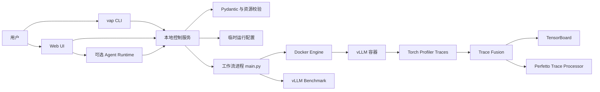

# VAP 部署、使用与技术报告

## 1. 文档目的

本文档面向 VAP 的部署人员、使用人员和维护人员，覆盖：

- 生产可用的本地部署方式；
- 安装、升级、启动、使用、清理和卸载命令；
- 配置文件与运行产物说明；
- 系统架构、执行流程、技术选型和安全设计；
- 当前限制、故障排查和上线验收清单。

VAP 用于自动完成 vLLM 服务部署、Benchmark、Torch Profiler 数据采集、Trace 合并以及 TensorBoard/Perfetto 可视化。

当前推荐将 VAP 部署为**受信任用户使用的本地运维工具**，服务监听 `127.0.0.1`，远程访问通过 SSH Tunnel 完成。不要直接暴露到公网。

---

## 2. 系统架构



核心组件：

- `cli.py`：提供 `vap start/run/clean/uninstall` 命令。
- `server.py`：本地 HTTP 控制服务、Web UI、认证、运行状态和 Agent 工具注册。
- `public/index.html`：配置编辑、校验、运行控制、日志与可视化入口。
- `config.py`：严格 Pydantic 配置模型。
- `validation.py`：端口、参数、安全边界和兼容性校验。
- `main.py`：Docker、vLLM、Benchmark、Profiler 和可视化工作流。
- `trace_fusion.py`：多 rank PyTorch Trace 合并。
- `agent_runtime.py`：可选 LLM Agent 及审批工具。
- `skills/TorchProfilerTraceSkill/`：基于 Perfetto SQL 的 Trace 分析能力。

---

## 3. 部署要求

### 3.1 支持环境

自动安装器当前支持：

- Linux x86_64；
- 可访问 Docker daemon；
- 可访问配置中的 Docker 镜像和模型目录；
- AMD ROCm GPU 环境；
- 用户具备目标设备与挂载目录的访问权限。

安装器会自行安装：

- Python 3.12 虚拟环境；
- 固定版本并校验 SHA256 的 `uv`；
- VAP Python 依赖；
- 固定版本并校验 SHA256 的 Perfetto Trace Processor。

Bootstrap 额外依赖 `git`。项目安装器需要 `curl`、`install`、`mktemp`、`sha256sum`、`tar` 和 `grep`。

### 3.2 Docker 检查

部署前确认：

```bash
docker info
docker images
ls -l /dev/kfd /dev/dri/
```

VAP 容器当前使用 host network、host IPC、ROCm 设备、`SYS_ADMIN`、`SYS_PTRACE` 和 `seccomp=unconfined`。这些配置用于性能分析，只应运行可信镜像、模型和配置。

### 3.3 网络端口

默认或常用端口：

- VAP Web UI：`8899`
- vLLM：由 `vllm_deploy_cfg.--port` 配置
- TensorBoard：由 `profiler_cfg.tensorboard_port` 配置，默认 `6006`
- Perfetto Trace Processor：固定 `9001`

---

## 4. 安装与升级

### 4.1 Bootstrap 安装

```bash
curl -fsSL https://raw.githubusercontent.com/Shan2L/VAP/main/bootstrap.sh | bash
```

安装指定分支或 Tag：

```bash
curl -fsSL https://raw.githubusercontent.com/Shan2L/VAP/main/bootstrap.sh \
  | VAP_REF=<branch-or-tag> bash
```

Bootstrap 会将受管理源码安装到：

```text
${XDG_DATA_HOME:-~/.local/share}/vap/source
```

随后执行项目中的 `install.sh`。

### 4.2 从源码安装

```bash
git clone https://github.com/Shan2L/VAP.git
cd VAP
bash install.sh
```

### 4.3 自定义安装目录

源码安装只需设置运行目录：

```bash
VAP_HOME=/path/to/vap-runtime bash install.sh
```

Bootstrap 安装可同时设置源码与运行目录：

```bash
curl -fsSL https://raw.githubusercontent.com/Shan2L/VAP/main/bootstrap.sh \
  | VAP_HOME=/path/to/vap-runtime \
    VAP_SOURCE_DIR=/path/to/vap-source \
    bash
```

默认运行目录为 `~/.vap`，命令入口为 `~/.local/bin/vap`。

确保命令目录在 `PATH` 中：

```bash
export PATH="$HOME/.local/bin:$PATH"
```

### 4.4 安装验证

```bash
vap --help
vap start --help
vap uninstall --help
```

### 4.5 升级

Bootstrap 安装可重新执行安装命令：

```bash
curl -fsSL https://raw.githubusercontent.com/Shan2L/VAP/main/bootstrap.sh | bash
```

源码安装可更新代码后重新运行：

```bash
git pull
bash install.sh
```

升级会保留已有的 `~/.vap/config.json` 和运行日志。

---

## 5. 配置管理

### 5.1 配置来源

VAP 使用以下配置层次：

1. `example-config.json`：唯一默认配置模板；
2. `~/.vap/config.json`：用户当前配置，存在时覆盖默认模板；
3. 浏览器 localStorage 草稿：仅在来源文件和修改版本匹配时恢复；
4. UI 启动任务时生成的临时配置：位于 `~/.vap/tmp/configs/`；
5. `vap run --config`：CLI 显式指定的配置。

修改 `example-config.json` 后，前端会通过 `/api/config?source=example` 获取最新默认值。旧浏览器草稿在来源文件变化后自动失效。

### 5.2 主要配置段

`model_cfg`

- `model_name`：模型名称或相对模型路径。
- `model_path`：宿主机模型根目录。

`vllm_deploy_cfg`

- vLLM Serve 参数。
- `--host` 和 `--port` 必须与 Benchmark 保持一致。
- `--trust-remote-code` 会触发安全提示。

`vllm_bench_cfg`

- `vllm bench serve` 参数。
- 包括 endpoint、数据集、输入输出长度、并发和请求速率。

`profiler_cfg`

- Torch Profiler 开关与采集参数。
- `torch_profiler_dir` 固定为 `/app/VAP/log/vllm-profile`。
- `tensorboard_port` 配置 TensorBoard 端口。

`container_cfg`

- Docker 镜像名称和 Tag；
- GPU 设备；
- 宿主机挂载；
- 环境变量。

`distributed_cfg`

- 当前保留用于未来分布式支持；
- 现阶段会显示黄色 Warning；
- Ray 端口和远端节点不会执行；
- VAP 会继续按本地单机模式运行。

### 5.3 配置校验

VAP 在运行前检查：

- Pydantic 模型结构；
- 必填字段和未知字段；
- 端口范围与占用；
- Deploy/Benchmark Host 和 Port 一致性；
- Docker 镜像、模型目录、设备和挂载路径；
- Tensor Parallel 与可见 GPU 数量；
- Shell 不安全字符；
- 固定 Profiler 目录；
- 高权限容器配置和 `--trust-remote-code` Warning。

---

## 6. 使用方法

### 6.1 启动 Web UI

```bash
vap start
```

等价于：

```bash
vap start --host 127.0.0.1 --port 8899
```

服务启动后会输出带一次性启动 Token 的 URL：

```text
Open VAP with this session URL: http://127.0.0.1:8899/?token=...
```

首次访问后，Token 会写入 `SameSite=Strict` Cookie，并从浏览器地址栏移除。

### 6.2 远程访问

推荐保持 VAP 监听本机地址，通过 SSH Tunnel 访问：

```bash
ssh -L 8899:127.0.0.1:8899 user@vap-host
```

随后在本地浏览器打开 VAP 输出的 URL。

不建议直接使用：

```bash
vap start --host 0.0.0.0
```

该方式会将服务暴露到所有网卡，但 VAP 本身不提供 TLS，也不应替代正式身份认证网关。

### 6.3 Web UI 工作流

1. 打开启动日志中的 Token URL。
2. 检查或修改模型、镜像、GPU、挂载、vLLM 和 Profiler 配置。
3. 点击 Validate。
4. 查看端口、资源和 Backend Validation 结果。
5. 确认黄色 Warning。
6. 点击 Run 并确认执行。
7. 查看 `vap_log.txt`、部署日志和 Benchmark 日志。
8. 运行结束后打开 TensorBoard 或 Perfetto。
9. 下载 Profile Trace 归档。

UI 不会在 Run 时覆盖 `~/.vap/config.json`，而是创建权限为 `0600` 的临时配置。

### 6.4 CLI 运行

```bash
vap run \
  --config ~/.vap/config.json \
  --visualization-host 127.0.0.1
```

CLI 执行完整工作流，并在 Benchmark 完成后启动可视化进程。

### 6.5 Agent 功能

Agent 是可选功能。启动前设置：

```bash
export VAP_LLM_SUBSCRIPTION_KEY="..."
export VAP_LLM_BASE_URL="https://llm-api.amd.com/OpenAI"
export VAP_LLM_MODEL="gpt-5.6-sol"
export VAP_AGENT_MAX_TOOL_ROUNDS=8
vap start
```

Agent 可读取配置、日志、运行状态和 Trace 分析结果。启动或停止任务等写操作必须经过用户审批。

### 6.6 清理日志

```bash
vap clean
```

也可以显式指定 VAP 日志目录：

```bash
vap clean --logs-dir ~/.vap/logs
```

清理函数会拒绝删除不属于 VAP 的任意目录。

### 6.7 卸载

默认卸载保留配置和日志：

```bash
vap uninstall
```

完整删除运行数据：

```bash
vap uninstall --purge
```

同时删除 Bootstrap 管理的源码：

```bash
vap uninstall --purge --remove-source
```

非交互环境：

```bash
vap uninstall --purge --remove-source --yes
```

卸载前必须停止正在运行的 VAP。

---

## 7. 可选 systemd 用户服务

对于固定工作站，可以使用 systemd User Service 管理 Web UI。

创建 `~/.config/systemd/user/vap.service`：

```ini
[Unit]
Description=VAP local profiling control service
After=network-online.target

[Service]
Type=simple
Environment=VAP_HOME=%h/.vap
ExecStart=%h/.local/bin/vap start --host 127.0.0.1 --port 8899
Restart=on-failure
RestartSec=3

[Install]
WantedBy=default.target
```

启用服务：

```bash
systemctl --user daemon-reload
systemctl --user enable --now vap
systemctl --user status vap
```

查看启动 Token：

```bash
journalctl --user -u vap -n 50 --no-pager
```

如需用户退出登录后继续运行：

```bash
loginctl enable-linger "$USER"
```

该命令可能需要管理员权限。

---

## 8. 运行产物

默认运行根目录：

```text
~/.vap/logs/<YYYYMMDD_HHMMSS>/
```

常见文件：

- `config.json`：本次运行配置副本；
- `vap_log.txt`：VAP 工作流日志；
- `vllm_deploy.log`：vLLM 启动日志；
- `vllm_bench.log`：Benchmark 日志；
- `vllm-profile/`：Profiler 原始数据；
- `*-merged_trace.json.gz`：多 Rank Trace 合并结果；
- `visualization_pids.json`：可视化进程 PID。

临时配置：

```text
~/.vap/tmp/configs/
```

工具和缓存：

```text
~/.vap/bin/
~/.vap/cache/
~/.vap/perfetto-home/
~/.vap/venv/
```

---

## 9. 技术报告

### 9.1 技术目标

VAP 解决以下问题：

- 将 vLLM 部署、Benchmark 和 Profiler 串联为可重复工作流；
- 降低 Torch Profiler 配置和 Trace 查找成本；
- 为端口、路径、设备和 Docker 参数提供运行前校验；
- 通过 Web UI 和 CLI 服务不同使用场景；
- 将运行日志与配置归档到独立目录，提升可追溯性；
- 提供 TensorBoard、Perfetto 和可选 Agent 分析入口。

### 9.2 技术选型

Python 3.12

- 作为控制面和工作流语言；
- 标准库提供 HTTP、进程、文件和归档能力。

Pydantic

- 严格配置模型；
- 禁止未知字段；
- 将结构错误提前到运行前。

Docker SDK for Python

- 创建和管理 vLLM 容器；
- 显式配置设备、挂载、IPC、网络、Capabilities 和环境变量。

原生 Web SPA

- 单文件 `public/index.html`；
- 无额外前端构建工具；
- 降低部署依赖和静态资源复杂度。

Torch TensorBoard Profiler

- 展示 PyTorch Profiler Trace；
- 支持算子、Kernel 和时间线分析。

Perfetto Trace Processor

- 提供 Trace SQL 查询；
- 与 Perfetto Web UI 配合进行时间线分析。

OpenAI-Compatible Agent

- 可选接入 AMD OpenAI-Compatible API；
- 工具调用与 LLM 推理解耦；
- 写操作需要显式审批。

### 9.3 配置数据流

```text
example-config.json
        │
        ├── 前端默认配置
        │
~/.vap/config.json
        │
        ├── 用户当前配置
        │
Browser Draft
        │
        └── 来源版本匹配时恢复
                │
                ▼
          UI 当前表单
                │
                ▼
~/.vap/tmp/configs/vap-config-*.json
                │
                ▼
            main.py
```

这种设计避免 Web UI 直接覆盖用户配置，同时保证每次运行有独立配置快照。

### 9.4 执行流程

1. Server 接收运行请求并执行后端校验。
2. Server 创建权限为 `0600` 的临时配置。
3. Server 启动独立 Workflow 子进程。
4. Workflow 创建运行日志目录并复制配置。
5. Workflow 检查端口、模型、镜像和设备。
6. Docker SDK 启动 vLLM 容器。
7. Workflow 轮询 vLLM `/health`。
8. Workflow 调用 `/start_profile`。
9. 容器内执行 `vllm bench serve`。
10. Workflow 在 `finally` 中调用 `/stop_profile`。
11. Workflow 停止并删除容器。
12. Trace Fusion 合并多 Rank Trace。
13. 启动 TensorBoard 和 Perfetto Trace Processor。

### 9.5 安全模型

HTTP 控制面：

- 每次 Server 启动生成随机 Token；
- Query Token 仅在根路径接受；
- 认证后使用 `SameSite=Strict` Cookie；
- 写请求要求 JSON；
- 检查同源 Origin；
- 默认监听 `127.0.0.1`。

配置与命令：

- Pydantic `extra=forbid`；
- 对 CLI 参数进行 Shell 安全校验；
- 使用 `shlex` 组合固定命令；
- 检查模型、设备和挂载路径；
- 固定 Profiler 输出目录；
- 高权限配置和 `--trust-remote-code` 显示 Warning。

文件系统：

- `VAP_HOME`、临时配置目录使用 `0700`；
- 配置文件使用 `0600`；
- 归档跳过符号链接；
- 归档限制文件数量和总大小；
- 清理和卸载拒绝危险路径。

供应链：

- 安装器固定 `uv` 和 Perfetto 版本；
- 下载内容执行 SHA256 校验；
- Bootstrap 拒绝覆盖未知或有本地修改的源码目录。

### 9.6 生命周期与失败处理

- Benchmark 失败时仍尝试停止 Profiler；
- 工作流结束时停止并删除 Docker 容器；
- 可视化进程写入 PID 文件并在退出时回收；
- Server 使用单次运行锁防止并发启动；
- Stop 请求可以在启动阶段被记录并随后处理；
- 临时配置会按保留策略清理。

### 9.7 测试状态

当前仓库使用 `unittest`：

```bash
cd VAP
uv run python -m unittest discover -s tests -v
```

当前验证覆盖：

- 配置安全与 Pydantic 行为；
- 分布式 Warning；
- CLI 参数引用；
- 私有目录权限；
- 清理边界；
- Web Token、Cookie、同源与并发启动；
- Profiler 异常后的 Stop；
- CLI uninstall 参数转发；
- Trace Fusion；
- Agent Skill Schema。

撰写本文档时，当前 26 项测试全部通过。

---

## 10. 已知限制

- 自动安装器仅支持 Linux x86_64。
- 分布式执行尚未实现，`distributed_cfg` 仅显示 Warning 并按本地模式运行。
- VAP 使用高权限 Docker 配置，不能运行不可信镜像和模型。
- `--trust-remote-code` 会执行模型仓库代码。
- Web Server 不提供 TLS，不应直接暴露公网。
- Perfetto Trace Processor 固定使用端口 `9001`。
- 超大 Trace 合并可能消耗较多内存。
- CLI 模式下，可视化进程存活期间主进程会持续运行。
- 当前不提供 Kubernetes、Docker Compose 或多租户部署。

---

## 11. 常见故障排查

### `vap: command not found`

```bash
export PATH="$HOME/.local/bin:$PATH"
```

确认：

```bash
ls -l ~/.local/bin/vap
```

### Docker 无法连接

```bash
docker info
```

确认当前用户具有 Docker 权限，Docker daemon 正常运行。

### 模型目录不存在

确认：

```bash
ls -ld <model_root>
ls -ld <model_root>/<model_name>
```

### GPU 不可见

```bash
ls -l /dev/kfd /dev/dri/
```

检查 `container_cfg.devices`、用户组和 Docker 权限。

### 端口占用

```bash
ss -ltnp | grep -E ':(8899|8080|6006|9001)\b'
```

修改对应配置或停止冲突进程。

### 前端没有加载最新配置

1. 点击 Reload；
2. 确认 `/api/config?source=current` 返回的路径；
3. 检查 `~/.vap/config.json` 是否覆盖 example config；
4. 强制刷新浏览器；
5. 重启 VAP Server。

### 找不到 Trace

检查：

```bash
ls -R ~/.vap/logs/<run>/vllm-profile
```

同时检查 vLLM 是否支持 `/start_profile` 和 `/stop_profile`。

### Agent 无法解锁

检查：

- Subscription Key；
- `VAP_LLM_BASE_URL`；
- `VAP_LLM_MODEL`；
- 网络访问；
- `VAP_LLM_TIMEOUT_SEC`。

---

## 12. 上线验收清单

安装：

- [ ] Linux x86_64 环境；
- [ ] Docker daemon 可用；
- [ ] `vap --help` 正常；
- [ ] `~/.local/bin` 已加入 PATH；
- [ ] 安装器下载校验通过。

配置：

- [ ] Docker 镜像存在；
- [ ] 模型目录存在；
- [ ] GPU 设备存在；
- [ ] Mount 源目录存在；
- [ ] Deploy/Benchmark Host 和 Port 一致；
- [ ] Tensor Parallel 不超过可见 GPU 数量；
- [ ] 已评估 `--trust-remote-code`；
- [ ] 已接受容器权限 Warning。

运行：

- [ ] VAP 监听 `127.0.0.1`；
- [ ] Token URL 可访问；
- [ ] Validation 无红色错误；
- [ ] vLLM `/health` 正常；
- [ ] Benchmark 成功；
- [ ] Profiler 正常启动和停止；
- [ ] Trace 文件生成；
- [ ] TensorBoard 可访问；
- [ ] Perfetto 可读取 Trace。

运维：

- [ ] 日志目录有容量监控；
- [ ] 升级前停止 VAP；
- [ ] 定期执行 `vap clean`；
- [ ] 已验证 `vap uninstall --help`；
- [ ] 远程访问通过 SSH Tunnel 或受控代理；
- [ ] 未将 Token URL 分享给无关人员。

