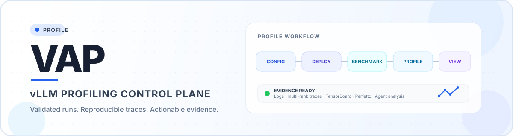

<p align="center">
  
</p>

VAP is a lightweight tool for deploying a vLLM service, running benchmark workloads, collecting profiler output, and viewing run logs through a simple web UI.

For installation, configuration, UI/CLI workflows, security notes, and troubleshooting, see the [User Guide](USER_GUIDE.md).

The project includes:

- `main.py`: runs the VAP workflow, including vLLM deployment, benchmark execution, profiling, TensorBoard, and Perfetto Trace Processor startup.
- `server.py`: starts a local configuration and control service.
- `public/index.html`: provides the browser UI for editing configs, validating resources, starting/stopping runs, viewing logs, and downloading trace archives.
- `example-config.json`: example configuration template.

## Setup

Install or update VAP directly from GitHub:

```bash
curl -fsSL https://raw.githubusercontent.com/Shan2L/VAP/main/bootstrap.sh | bash
```

The bootstrap installer keeps a managed source checkout at `~/.local/share/vap/source` and then runs the verified project installer. Set `VAP_REF` to install a specific branch or tag.

If you already have a source checkout, run the project installer directly:

```bash
bash install.sh
```

The installer creates `~/.vap`, installs pinned and checksum-verified `uv` and Perfetto binaries into `~/.vap/bin`, creates `~/.vap/venv`, installs VAP and its dependencies in editable mode, verifies the `vap` command, installs a wrapper at `~/.local/bin/vap`, copies the default config to `~/.vap/config.json`, and warms the Perfetto cache under `~/.vap/perfetto-home/`.

The bundled installer currently supports Linux x86_64 only. It fails closed on unknown platforms instead of executing an unverified remote installer. Install `uv` and Perfetto manually when using another platform.

Make sure `~/.local/bin` is in `PATH` if `vap` is not found after installation.

Make sure Docker is available and the configured image, model path, devices, and mounts exist on the host.

## Uninstall

Stop VAP, then run:

```bash
bash uninstall.sh
```

The default uninstall removes VAP executables, its virtual environment, downloaded tools, and caches while preserving `~/.vap/config.json` and `~/.vap/logs/`.

To remove all VAP runtime data and the managed bootstrap source checkout:

```bash
bash uninstall.sh --purge --remove-source
```

Use `--yes` for non-interactive environments. Custom `VAP_HOME` and `VAP_SOURCE_DIR` values should be supplied to the uninstaller in the same way they were supplied during installation.

## Start the UI

Run the local control server:

```bash
vap start
```

Open the session URL printed by the server. It includes a per-process startup token:

```text
Open VAP with this session URL: http://127.0.0.1:8899/?token=...
```

The first request stores the session in a `SameSite=Strict` cookie and removes the token from the visible browser URL. Direct API clients must send the token in `X-VAP-Token`; state-changing requests must also use JSON and a same-origin `Origin` header when one is present.

The UI lets you:

- edit VAP configuration values;
- validate ports, model paths, Docker image, devices, mounts, and config structure;
- chat with the Agent panel after an LLM key is configured or validated;
- start or stop a VAP run after validation;
- view current run logs;
- open TensorBoard after it starts successfully;
- open Perfetto UI after the trace processor starts on port `9001`;
- download the current run's `vllm-profile` files as a zip archive.

## Run from CLI

You can also run VAP directly with a config file:

```bash
vap run --config ~/.vap/config.json --visualization-host 127.0.0.1
```

Run outputs are written under `~/.vap/logs/`.

To remove generated logs:

```bash
vap clean
```

## Configuration Notes

The web UI does not overwrite the original config when starting a run. It sends the current form data to the backend, which creates a temporary config file under `~/.vap/tmp/configs/` for that run.

The deploy and benchmark `--host` / `--port` values should stay consistent. The UI keeps these fields synchronized automatically.

`profiler_cfg.tensorboard_port` controls TensorBoard. Perfetto Trace Processor is fixed to local port `9001` so `https://ui.perfetto.dev/` can discover it through the standard local endpoint.

Configuration is strict: unknown fields, invalid ports, mismatched deploy/benchmark endpoints, and unsafe CLI values are rejected by both the UI and CLI. Distributed execution is not implemented yet; a present `distributed_cfg` produces a warning and VAP continues in local mode.

VAP safely quotes deploy, benchmark, and profiler arguments before invoking the fixed shell wrapper used for log redirection.

## Security Warnings

VAP currently keeps the existing profiling-compatible Docker behavior:

- host networking;
- `SYS_ADMIN` and `SYS_PTRACE` capabilities;
- `seccomp=unconfined`;
- ROCm device mounts, including `/dev/kfd` and `/dev/mem`.

The UI and CLI display a warning instead of blocking these settings. Run only trusted images, models, configs, and model repositories.

The example config still includes `--trust-remote-code` for compatibility. This allows model repository code to execute inside the elevated VAP container. Remove the option unless the model source is trusted.

Runtime config and temporary config files are stored with private permissions. Temporary run configs older than seven days are removed when a new temporary config is created.

## Trace Fusion Attribution

Multi-rank PyTorch JSON trace fusion is built into VAP and uses only the Python standard library. Its implementation is adapted from AMD-AGI TraceLens `TraceFuse` at commit `2eae9b056b3db46656bda030499ec6d4e1310ea4`, under the MIT License. See [THIRD_PARTY_NOTICES.md](THIRD_PARTY_NOTICES.md).

## Agent Chat

The Agent panel is a Hermes-style VAP tool agent specialized for vLLM profiling. It starts by asking which model you want to profile, then guides you through model paths, Docker/GPU settings, tensor parallel size, benchmark shape, profiler options, validation, and final run approval. It uses an AMD OpenAI-compatible endpoint for reasoning, but VAP operations are exposed through explicit backend tools instead of UI automation.

Configure the subscription key before starting the server:

```bash
export VAP_LLM_SUBSCRIPTION_KEY="..."
export VAP_LLM_BASE_URL="https://llm-api.amd.com/OpenAI"
export VAP_LLM_MODEL="gpt-5.6-sol"
export VAP_AGENT_MAX_TOOL_ROUNDS=8
vap start
```

If `VAP_LLM_SUBSCRIPTION_KEY` is not set, the Agent tab shows a centered unlock form. Enter the subscription key there; the backend validates it with the LLM API and stores it only in the current server process memory.

The agent can call read-only and safe tools for config, run status, logs, validation, port checks, and resource checks. Actions that affect running processes, such as `start_run` and `stop_run`, require explicit approval in the Agent panel before the backend executes them.

The VAP tool registry is kept separate from the LLM client so the same tools can later be exposed through MCP or a Hermes Agent bridge.

## Generated Files

Runtime state is generated under `~/.vap/`:

- `~/.vap/config.json`
- `~/.vap/logs/`
- `~/.vap/tmp/configs/`
- `~/.vap/bin/`
- `~/.vap/perfetto-home/`

These files are run artifacts and can be deleted when they are no longer needed.

`vap clean` only removes the configured VAP log directory and refuses arbitrary filesystem paths.
