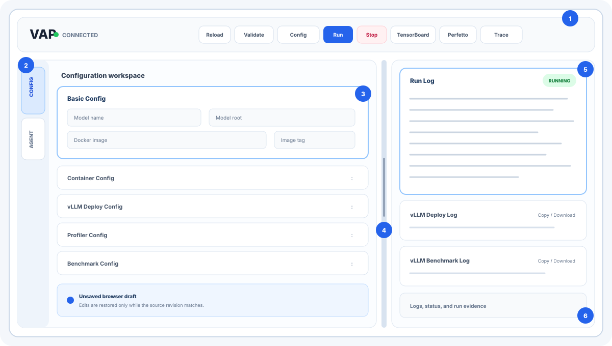
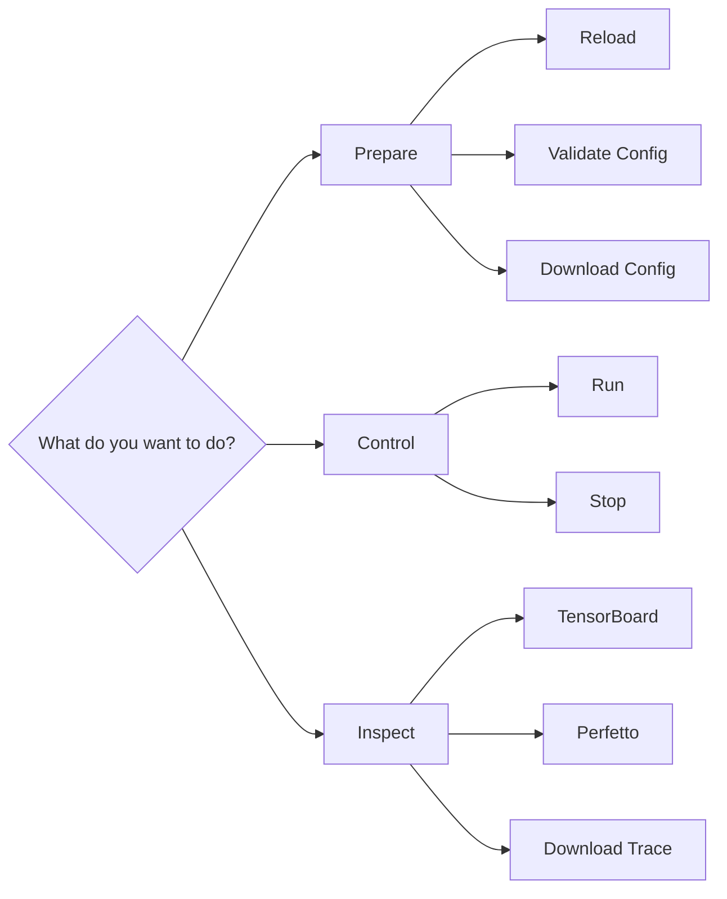
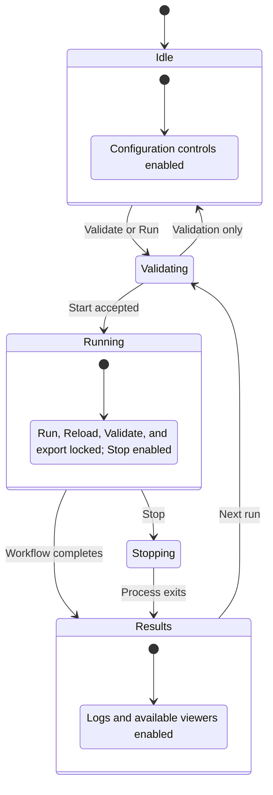
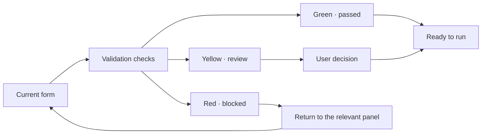
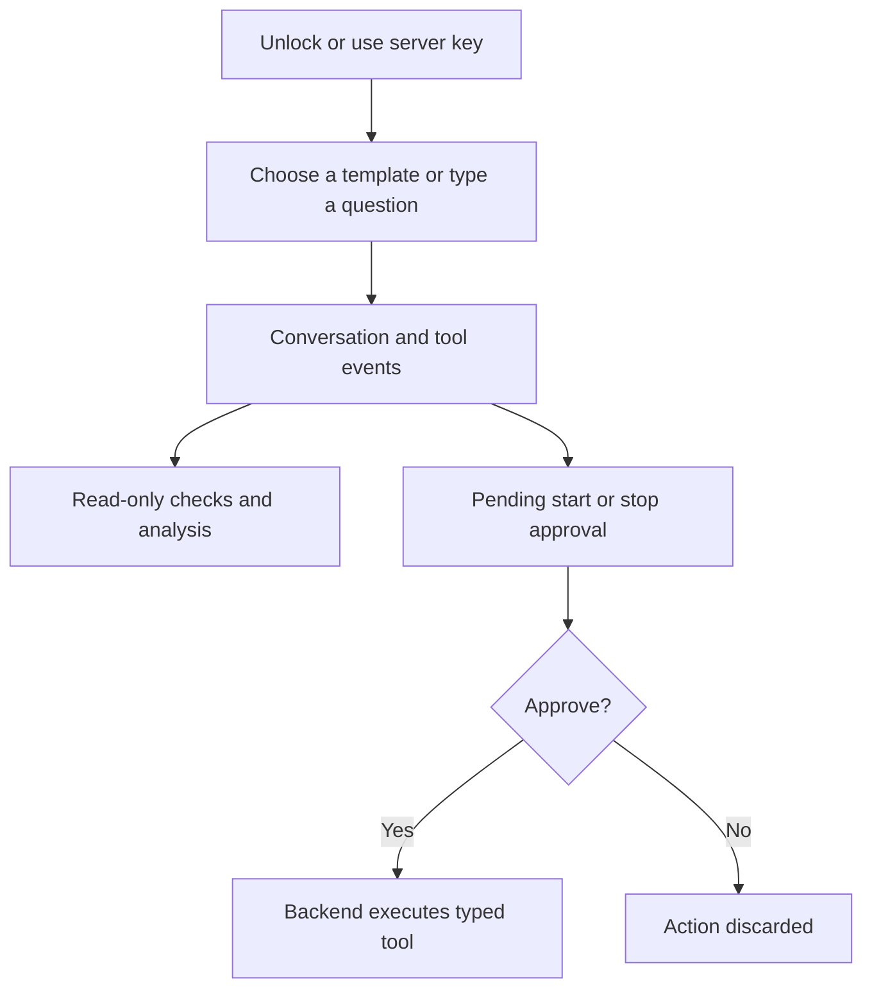
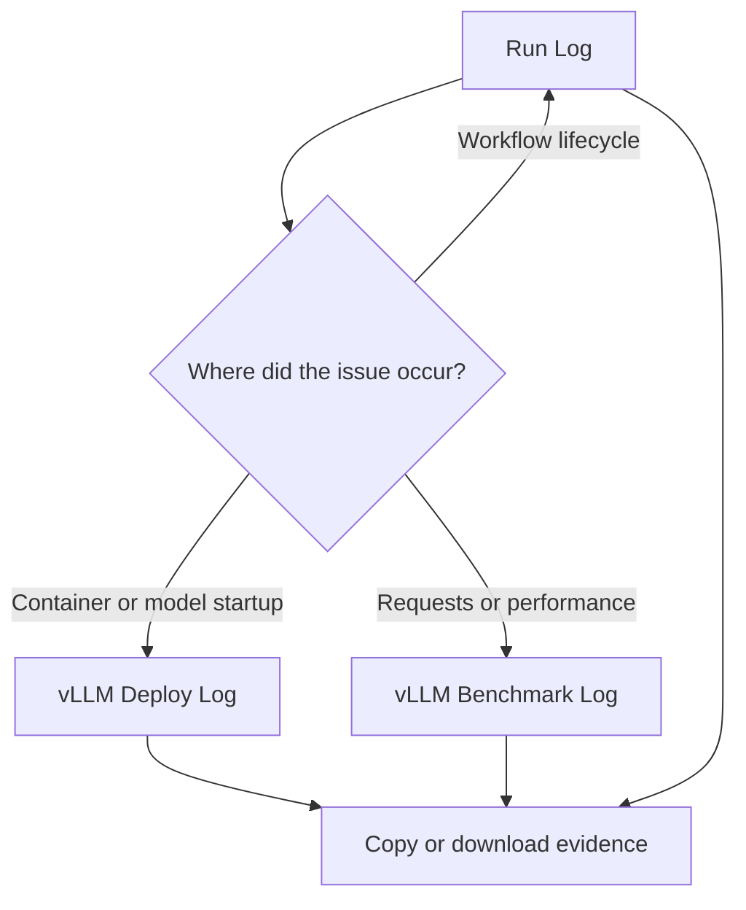

# VAP Web UI Tour

This page is a visual map of the VAP interface: where to look, what changes
during a run, and which controls belong to configuration, execution, or
analysis. Configuration-field semantics remain in the
[User Guide](https://shan2l.github.io/VAP/user-guide/).

## Screen Map

{ .vap-ui-overview }

-   **1 · Header toolbar**

    Global actions for theme, configuration, workflow control, and result
    viewers.

-   **2 · Workspace switcher**

    Changes the left workspace between deterministic configuration and the
    optional Agent.

-   **3 · Active workspace**

    Shows one expanded task area at a time so a long configuration remains
    scannable.

-   **4 · Resizable splitter**

    Balances editing space against log visibility. It disappears when the layout
    stacks on a small screen.

-   **5 · Run status and evidence**

    The active Run Log carries lifecycle state and the main explanation of what
    VAP is doing.

-   **6 · Specialized logs**

    Deployment and benchmark evidence remain separate, copyable, and
    downloadable.

## Three Ways to Work

-   **Config workspace**

    Direct, deterministic editing. Use it when you know the model, image, and
    workload settings you want. Panels collapse so only the current concern is
    expanded.

-   **Agent workspace**

    Guided reasoning. Use it to refine a plan, interpret warnings, analyze logs,
    or run the trace-analysis Skill. Mutating actions still require approval.

-   **Log workspace**

    Shared evidence. It remains visible beside either Config or Agent, allowing
    the user to compare recommendations or edits with actual runtime output.

The Config and Agent tabs change only the left workspace. They do not start,
stop, or alter a running workflow.

## Toolbar by Intent

### Prepare

- **Reload** returns the form to the latest backend configuration and discards
  the browser draft.
- **Validate Config** runs the same checks used before execution but does not
  start vLLM.
- **Download Config** exports the current form as JSON; it does not overwrite
  the saved config.

### Control

- **Run** validates, creates a private run snapshot, and starts the workflow.
- **Stop** terminates the active process group. A request made during startup is
  remembered.

### Inspect

- **TensorBoard** appears when the TensorBoard process is ready.
- **Perfetto** automatically sends the selected trace when local integration is
  available.
- **Download Trace** downloads the complete profile archive.

If port `9001` is unavailable, the Perfetto button opens a manual-import dialog
with a single-trace download and a link to
[`https://ui.perfetto.dev/`](https://ui.perfetto.dev/).

## Interface States

The visual state is intentional:

- controls that could conflict with an active run are disabled;
- `Stop` is enabled only during a run;
- result buttons appear progressively as artifacts and viewer processes become
  ready.

## Validation at a Glance

The validation modal is both progress display and navigation aid:

- green identifies completed checks;
- yellow identifies optional or acknowledged risks;
- red identifies the area that needs attention;
- the final action reflects whether the backend considers the payload runnable.

Perfetto port `9001` is optional and therefore appears as yellow when occupied.
Structural and safety errors remain red.

## Configuration Panels as an Accordion

The Config workspace uses collapsible panels to reduce visual noise:

- **Basic Config** identifies the model and image;
- **Distributed Config** is a read-only future-facing area;
- **Container Config** manages runtime resources;
- **vLLM Deploy Config** is an open-ended argument editor;
- **Profiler Config** is the fixed VAP profiler schema;
- **Benchmark Config** is an open-ended workload argument editor.

Only the active panel expands. The parameter meanings and examples are
documented in the
[User Guide configuration section](https://shan2l.github.io/VAP/user-guide/#5-configuring-a-model/);
this page intentionally does not duplicate them.

## Agent Workspace as a Guided Layer

The Agent workspace adds guided reasoning without replacing the Config
workspace:

- templates begin common profiling tasks;
- tool events expose what the Agent inspected;
- approval cards make side effects visible;
- Clear Chat removes conversation state without changing config or artifacts;
- the message area keeps analysis beside the runtime logs.

See [Agent and Skills](https://shan2l.github.io/VAP/agent/) for tool inventory,
Skill behavior, limitations, and safety boundaries.

## Logs as a Diagnostic Funnel

- Start with **Run Log** for lifecycle and the current status.
- Open **vLLM Deploy Log** for image, model loading, memory, device, or server
  startup failures.
- Open **vLLM Benchmark Log** for request progress, throughput, latency, and
  workload errors.

Every log can be copied or downloaded without changing the active run.

## Common User Paths

### First profiling run

`Config` → `Validate Config` → review colors → `Run` → watch `Run Log` →
`TensorBoard` or `Perfetto`.

### Diagnose a failed start

`Run Log` → `vLLM Deploy Log` → correct the relevant Config panel → validate
again.

### Investigate performance

`vLLM Benchmark Log` → `Download Trace` or `Perfetto` → Agent
`Analyze latest trace`.

### Ask for guided setup

`Agent` → `New profiling run` → answer focused questions → inspect tool results
→ approve only after reviewing the final plan.

## Related Documentation

- [Overview](https://shan2l.github.io/VAP/)
- [User Guide](https://shan2l.github.io/VAP/user-guide/)
- [Agent and Skills](https://shan2l.github.io/VAP/agent/)
- [Deployment and Technical Report](https://shan2l.github.io/VAP/deployment/)
