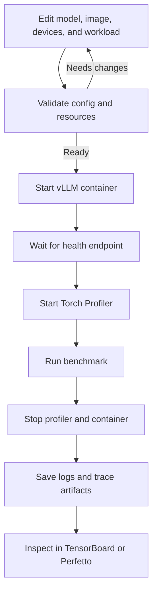
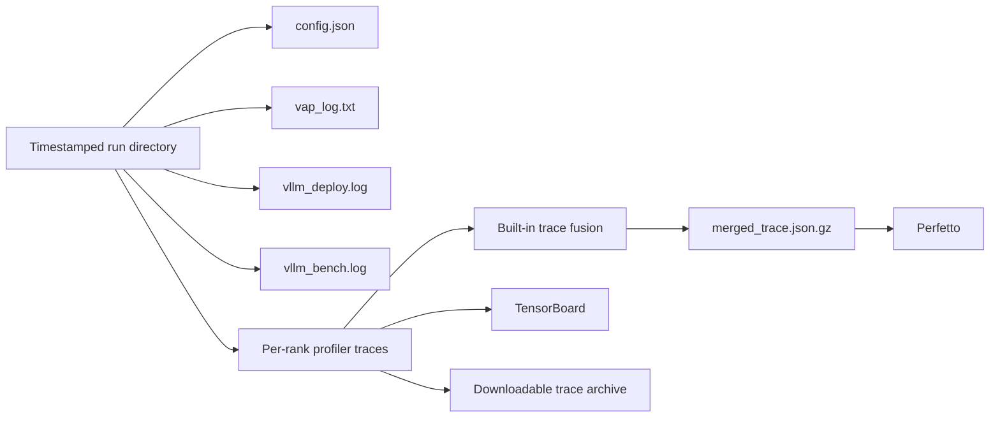

# VAP User Guide

This guide is intended for users who need to deploy vLLM, run benchmarks, collect
PyTorch profiler traces, and analyze the results with TensorBoard, Perfetto, or
the VAP Agent.

## 1. VAP Workflow

A complete run performs the following steps in order:

1. Validate the configuration, ports, model directories, Docker image, devices, and mounts.
2. Start the vLLM Docker container using the host network.
3. Wait for the vLLM `/health` endpoint to become ready.
4. Call `/start_profile` to start the profiler.
5. Run `vllm bench serve` in the container.
6. Call `/stop_profile` to stop the profiler.
7. Stop and remove the vLLM container for this run.
8. Merge multi-rank JSON traces, then start TensorBoard and the Perfetto Trace Processor.



VAP supports both Web UI and CLI workflows. New users should start with the Web UI.

## 2. System Requirements

Before installation, confirm that:

- The operating system is Linux x86_64. The bundled installation script does not currently support other platforms.
- The Docker daemon is running, and the current user has permission to access Docker.
- The model directory and required ROCm devices exist on the host.
- The Docker image specified in the configuration already exists locally.
- Port `8899`, the vLLM port, the TensorBoard port, and port `9001` are available.
- The HTTPS endpoints required to install dependencies are accessible.

VAP is currently configured for ROCm profiling and uses:

- `/dev/kfd`
- `/dev/mem`
- The `/dev/dri/renderD*` devices specified in the configuration, or `/dev/dri/` by default
- `SYS_ADMIN`, `SYS_PTRACE`
- `seccomp=unconfined`
- Host networking

Therefore, use only trusted images, models, configurations, and mount directories.

## 3. Installation

Install or update VAP directly from GitHub:

```bash
curl -fsSL https://raw.githubusercontent.com/Shan2L/VAP/main/bootstrap.sh | bash
```

The bootstrap installer stores a managed source checkout at
`~/.local/share/vap/source`. To install a specific branch or tag:

```bash
curl -fsSL https://raw.githubusercontent.com/Shan2L/VAP/main/bootstrap.sh \
  | VAP_REF=v0.2.0 bash
```

### One-Command Remote Deployment

Run the following on your local machine after replacing `{user}` and
`{hostname}`:

```bash
ssh -t -L 8899:127.0.0.1:8899 {user}@{hostname} \
  'curl -fsSL https://raw.githubusercontent.com/Shan2L/VAP/main/bootstrap.sh | bash && exec ~/.local/bin/vap start --host 127.0.0.1'
```

This single SSH command:

- downloads and executes the bootstrap installer on the remote host;
- starts VAP on remote `127.0.0.1:8899`;
- forwards it to local `127.0.0.1:8899`.

Open the tokenized URL printed in the SSH session in your local browser. Keep
the SSH session open while using VAP. Press `Ctrl-C` to stop the remote VAP
process and close the tunnel.

The remote host must already satisfy the Docker, GPU, model, and network
requirements described in this guide. If local port `8899` is occupied, choose
another local port in `-L`, for example `-L 18899:127.0.0.1:8899`, and replace
port `8899` with `18899` when opening the printed URL locally.

If you already have a source checkout, run:

```bash
bash install.sh
```

The installation script:

- Creates a private runtime directory at `~/.vap/`.
- Installs a pinned version of `uv` verified with SHA256.
- Creates `~/.vap/venv`.
- Installs VAP and its dependencies in editable mode.
- Verifies that the `vap` command starts successfully.
- Installs a pinned, verified version of the Perfetto Trace Processor.
- Creates `~/.local/bin/vap`.
- Copies `example-config.json` to `~/.vap/config.json` during the first installation.

If `vap` cannot be found, add the user bin directory to `PATH`:

```bash
export PATH="$HOME/.local/bin:$PATH"
```

You can add this line to `~/.bashrc`.

### Installed Commands

The installer prints the available commands when installation finishes:

- `vap start [--host HOST] [--port PORT]` starts the Web UI and local control server. It binds to `0.0.0.0` by default.
- `vap run [--config FILE] [--visualization-host HOST]` runs deployment, benchmark, profiling, and visualization without the Web UI.
- `vap clean [--logs-dir DIR]` removes generated VAP logs. It refuses arbitrary filesystem paths.
- `vap uninstall [--purge] [--remove-source] [--yes]` removes the managed installation. By default it preserves config and logs.
- `vap --help` displays the command list.
- `vap <command> --help` displays options for one command.

### Development Mode

To run directly from the source directory without using the installation script:

```bash
uv venv .venv --python 3.12
uv pip install --python .venv/bin/python -e .
uv run --no-sync vap start
```

Install the editable project separately first. This provides visible progress while
dependencies are installed and prevents the startup command from appearing to hang.

## 4. Starting the Web UI

Start the local service:

```bash
vap start
```

By default, the service listens on `0.0.0.0:8899` and prints local, hostname,
and IP candidates:

```text
VAP session URL candidates:
  Local: http://127.0.0.1:8899/?token=...
  Network candidate: http://vap-host:8899/?token=...
  Network candidate: http://10.0.0.8:8899/?token=...
```

You must use the complete URL printed by the current startup process. After the
first access, VAP sets a `SameSite=Strict` session cookie and removes the token
from the browser address bar.

The hostname/IP entries are candidates rather than a reachability guarantee.
Access from another machine still requires working DNS or routing and a firewall
rule that permits `8899/tcp`.

Important:

- VAP generates a new token each time it restarts.
- Do not share a URL that contains a token.
- If the page returns `401 Unauthorized`, copy the latest startup URL again.
- The default `0.0.0.0` binding has no TLS. Use it only with a firewall and a
  trusted network.

To restrict access to the local machine:

```bash
vap start --host 127.0.0.1 --port 8899
```

## 5. Configuring a Model

The default configuration path is:

```text
~/.vap/config.json
```

Configuration validation is strict. Unknown fields, invalid ports, mismatched
deployment and benchmark addresses, and unsafe CLI characters are rejected.
Distributed configuration currently produces a warning and runs locally.

### 5.1 `model_cfg`

- `model_name`: The model's relative path under the model root directory, for example
  `Qwen/Qwen3-0.6B`.
- `model_path`: The model root directory on the host, for example `/data/huggingface`.

VAP verifies that the following complete path exists:

```text
<model_path>/<model_name>
```

The model root directory is automatically mounted in the container at `/tmp/vap/models`.

### 5.2 `distributed_cfg`

Distributed execution is not currently implemented. The field may remain in the
configuration for future use, but VAP displays a warning and ignores it during
the current local run.

```json
"distributed_cfg": null
```

If worker nodes or a Ray configuration are provided, the UI and CLI explicitly
reject the configuration instead of silently falling back to single-node execution.

### 5.3 `container_cfg`

- `image_name`: Docker image name without the tag.
- `image_tag`: Docker image tag.
- `devices`: Additional GPU render devices.
- `mounts`: Additional bind mounts.
- `env_vars`: Environment variables passed to the vLLM container.

Device example:

```json
"devices": [
  "/dev/dri/renderD128",
  "/dev/dri/renderD129"
]
```

Mount example:

```json
"mounts": [
  {
    "source": "/data/shared",
    "target": "/data/shared",
    "type": "bind"
  }
]
```

`source` and `target` must be absolute paths. VAP automatically mounts the model
directory and runtime logs, so they do not need to be configured again.

When `devices` is empty, VAP uses `/dev/dri/` by default and assumes eight visible
devices when validating tensor parallelism. To ensure accurate validation,
explicitly list the render devices.

### 5.4 `vllm_deploy_cfg`

This object directly specifies the `vllm serve` arguments:

- Each key must start with `-`.
- A `null` value represents a flag with no value.
- `--host` and `--port` must match the benchmark configuration.
- `-tp` specifies the tensor parallel size.
- `--gpu-memory-utilization` controls the proportion of GPU memory used.
- `--max-model-len` controls the maximum context length.

Example:

```json
"vllm_deploy_cfg": {
  "--host": "0.0.0.0",
  "--port": 8080,
  "--gpu-memory-utilization": 0.9,
  "--max-model-len": 32768,
  "-tp": 2
}
```

`--trust-remote-code` executes code from the model repository inside a privileged
container. Include it only when the model source is trusted:

```json
"--trust-remote-code": null
```

### 5.5 `profiler_cfg`

- `profiler`: Usually set to `torch`.
- `torch_profiler_dir`: Profiler output directory inside the container.
- `torch_profiler_record_shapes`: Records tensor shapes.
- `torch_profiler_with_stack`: Records call stacks and may significantly increase overhead.
- `torch_profiler_with_memory`: Records memory events.
- `torch_profiler_with_flops`: Estimates FLOPs.
- `torch_profiler_use_gzip`: Compresses the trace.
- `delay_iterations`: Number of iterations to wait before collection starts.
- `max_iterations`: Maximum number of iterations to collect.
- `tensorboard_port`: TensorBoard listening port; defaults to `6006`.

Collecting stacks, memory events, and shapes increases trace size and runtime
overhead. Enable these options as needed for the issue being investigated.

### 5.6 `vllm_bench_cfg`

This object specifies the `vllm bench serve` arguments. Common fields include:

- `--backend`
- `--host`
- `--port`
- `--endpoint`
- `--dataset-name`
- `--random-input-len`
- `--random-output-len`
- `--max-concurrency`
- `--num-prompts`
- `--request-rate`

The deployment and benchmark values for `--host` and `--port` must match exactly.

## 6. Using the Web UI

### 6.1 Config Page

The Config page allows you to edit:

- The model name and model root directory.
- The Docker image and tag.
- Devices, mounts, and environment variables.
- vLLM deployment arguments.
- Profiler arguments.
- Benchmark arguments.

The controls at the top are:

- `Reload`: Reload the current configuration.
- `Validate Config`: Perform full validation without starting a run.
- `Download Config`: Download the JSON configuration currently shown in the form.
- `Run`: Validate the configuration and start a run.
- `Stop`: Stop the current run and its child processes.
- `TensorBoard`: Open TensorBoard after it is ready.
- `Perfetto`: Send the trace to the Perfetto UI after it is ready.
- `Download Trace`: Download the current `vllm-profile` directory as a zip archive.

Clicking `Run` does not overwrite `~/.vap/config.json`. The current form is saved as:

```text
~/.vap/tmp/configs/vap-config-<timestamp>-<id>.json
```

Temporary configurations use `0600` permissions. Files older than seven days
are removed when a new temporary configuration is created.

### 6.2 Validation Results

Validation checks:

- The JSON/Pydantic structure.
- Deployment and benchmark hosts and ports.
- Port conflicts.
- The model directory.
- The Docker image.
- Devices and mounts.
- The tensor parallel size.
- Unsafe shell characters.
- Risks associated with Docker privileges and `--trust-remote-code`.

Errors prevent the backend from running. Security warnings do not prevent a run,
but they should be reviewed before proceeding.

### 6.3 Log Area

The UI displays:

- `vap_log.txt`: Main VAP workflow log.
- `vllm_deploy.log`: vLLM service startup log.
- `vllm_bench.log`: Benchmark log.

Each log panel supports a separate download.

## 7. Using the Agent

The Agent can help you:

- Read and explain the current configuration.
- Check ports, resources, and run status.
- View logs.
- Generate configuration recommendations.
- Run Perfetto SQL.
- Generate TorchProfiler trace reports.
- Request that a run be started or stopped.

Starting and stopping are operations with side effects. The Agent must first
request approval and performs the operation only after the user explicitly approves it.

### 7.1 Setting the LLM Key Securely

Do not enter the key directly on the command line, because it will be stored in
shell history. The recommended method is:

```bash
read -rsp "VAP subscription key: " VAP_LLM_SUBSCRIPTION_KEY
echo
export VAP_LLM_SUBSCRIPTION_KEY
vap start
```

Optional environment variables:

```bash
export VAP_LLM_BASE_URL="https://llm-api.amd.com/OpenAI"
export VAP_LLM_MODEL="gpt-5.5"
export VAP_LLM_TIMEOUT_SEC=180
export VAP_AGENT_MAX_TOOL_ROUNDS=8
```

Alternatively, leave the environment variable unset, enter the key on the Agent
page, and click `Validate & Unlock`. The key is stored only in the memory of the
current server process and must be entered again after a restart.

The LLM subscription key and the Web UI startup token are separate credentials.

## 8. Using the CLI

Run the workflow directly:

```bash
vap run \
  --config ~/.vap/config.json \
  --visualization-host 127.0.0.1
```

The CLI and UI use the same strict configuration validation.

After profiling completes, the command continues running to host TensorBoard and
Perfetto. This does not indicate that the process is stuck. Press `Ctrl-C` to
stop the visualization processes.

Clean the logs:

```bash
vap clean
```

For security, `vap clean --logs-dir` accepts only the standard logs directory
under the current `VAP_HOME` and refuses to delete arbitrary paths. Stop any
running VAP process before cleaning.

## 9. Output Files

Each run creates:

```text
~/.vap/logs/<YYYYMMDD_HHMMSS>/
```

Common files:

```text
config.json
vap_log.txt
vllm_deploy.log
vllm_bench.log
visualization_pids.json
vllm-profile/
```



If multiple rank traces exist, VAP merges them using its built-in standard-library
implementation and produces a file similar to:

```text
<timestamp>-<model>-merged_trace.json.gz
```

During the merge, VAP offsets PIDs, flow IDs, and correlation IDs for different
ranks and adds `RANK N - CPU/GPU` metadata so ranks can be viewed side by side
in Perfetto.

The merge process loads each rank's JSON trace into memory. For very large traces,
reduce the number of profiler iterations or retain only the ranks that need analysis.

## 10. API Calls

Automation scripts must obtain the token from the startup log and send it in the
`X-VAP-Token` header.

First, place the token portion of the session URL in a regular shell variable:

```bash
export VAP_ACCESS_TOKEN="<token from the current VAP session URL>"
```

`VAP_ACCESS_TOKEN` is only a client-side variable used in the examples below.
It is not an environment variable automatically created by VAP.

Read the status:

```bash
curl \
  -H "X-VAP-Token: $VAP_ACCESS_TOKEN" \
  http://127.0.0.1:8899/api/run/status
```

Stop the run:

```bash
curl \
  -X POST \
  -H "X-VAP-Token: $VAP_ACCESS_TOKEN" \
  -H "Content-Type: application/json" \
  -d '{}' \
  http://127.0.0.1:8899/api/run/stop
```

Do not hard-code the access token in scripts or commit it to version control.

## 11. Troubleshooting

### `vap: command not found`

Run:

```bash
export PATH="$HOME/.local/bin:$PATH"
```

Alternatively, use development mode:

```bash
uv run --no-sync vap start
```

### `vap` Still Appears After Uninstall

The default uninstaller removes the managed `~/.local/bin/vap` wrapper. First
clear Bash's command cache and inspect every matching command:

```bash
hash -r
type -a vap
```

The uninstaller prints one of `Removed command`, `Command already absent`, or
`Keeping unmanaged command`. An unmanaged command is deliberately preserved.
If an interrupted older uninstall left a managed wrapper behind, run the
fallback from the managed source checkout:

```bash
bash ~/.local/share/vap/source/uninstall.sh --yes
```

### `uv run` Produces No Output for a Long Time

The first run may be synchronizing dependencies. Run the commands separately to
see progress:

```bash
uv sync -v
uv run --no-sync vap start
```

### `401 Unauthorized`

The server has restarted, or the cookie/token has expired. Use the complete,
newly printed session URL from the current terminal.

### Configuration Contains an Unknown/Extra Field

VAP does not ignore spelling errors. Compare the configuration with
`example-config.json`, then remove unknown fields or correct their names.

### `Distributed runs are not supported yet`

VAP currently ignores `distributed_cfg` and continues in local mode. Set it to
`null` to hide the warning.

### Docker Image Does Not Exist

Check:

```bash
docker image inspect <image>:<tag>
```

If necessary, log in to the registry and pull the image first.

### Docker Is Inaccessible

Verify the daemon and the current user's permissions:

```bash
docker info
```

### Model Directory Does Not Exist

Confirm that the host path `<model_path>/<model_name>` exists and can be read by
the current user and the Docker daemon.

### ROCm Device Does Not Exist

Check:

```bash
ls -l /dev/kfd /dev/dri/
```

Then correct `container_cfg.devices`.

### Port Is Already in Use

Check:

```bash
ss -ltnp
```

By default, check ports `8899`, `8080`, `6006`, and `9001`.

### vLLM Readiness Timeout

VAP waits for up to approximately 30 minutes. Review `vllm_deploy.log`. Common
causes include:

- An incorrect model path.
- An image that is incompatible with the model architecture.
- A mismatch between the GPU count and `-tp`.
- Insufficient GPU memory.
- vLLM arguments that are not supported by the installed version.

### `/start_profile` or `/stop_profile` Fails

Confirm that the current vLLM version supports the profiler endpoint, and check
that `--profiler-config.*` is passed correctly in the deployment arguments.

### TensorBoard Button Is Unavailable

Confirm that:

- Profiling completed successfully.
- A trace exists in `vllm-profile`.
- The TensorBoard port is available.
- The installed environment includes `torch-tb-profiler`.

### Perfetto Cannot Open the Trace

Confirm that:

- Port `9001` is available.
- `~/.vap/bin/trace_processor` is executable.
- The browser is allowed to open `https://ui.perfetto.dev/`.
- The trace file is valid JSON, JSON.GZ, or PFTrace.

### Agent Is Locked or an LLM Request Fails

Check:

- Whether the subscription key is valid.
- Whether `VAP_LLM_BASE_URL` and `VAP_LLM_MODEL` are correct.
- Whether the network can reach the LLM endpoint.
- Whether `VAP_LLM_TIMEOUT_SEC` needs to be increased.

## 12. Updating and Uninstalling

If VAP was installed with the bootstrap command, run that command again to fetch
the selected branch or tag and reinstall it. The bootstrap installer refuses to
overwrite local source changes.

After manually updating a source checkout, reinstall it:

```bash
bash install.sh
```

In development mode:

```bash
uv pip install --python .venv/bin/python -e .
```

Stop VAP before uninstalling. The default command removes the managed
`~/.local/bin/vap` wrapper, VAP executables, the virtual environment,
downloaded tools, and caches while preserving `~/.vap/config.json` and
`~/.vap/logs/`:

```bash
vap uninstall
```

To remove all runtime data and the managed bootstrap source checkout:

```bash
vap uninstall --purge --remove-source
```

Use `--yes` for non-interactive environments. If installation used custom
`VAP_HOME` or `VAP_SOURCE_DIR` values, pass the same environment variables to
the uninstaller. From a source checkout, `bash uninstall.sh` remains available
as a fallback.

## 13. Third-Party Attribution

VAP's built-in multi-rank trace fusion is based on the MIT-licensed AMD-AGI
TraceLens `TraceFuse` implementation. For complete attribution, the relevant
commit, and the license text, see
[THIRD_PARTY_NOTICES.md](THIRD_PARTY_NOTICES.md).
