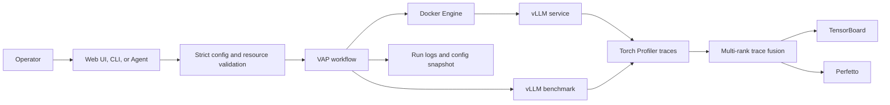
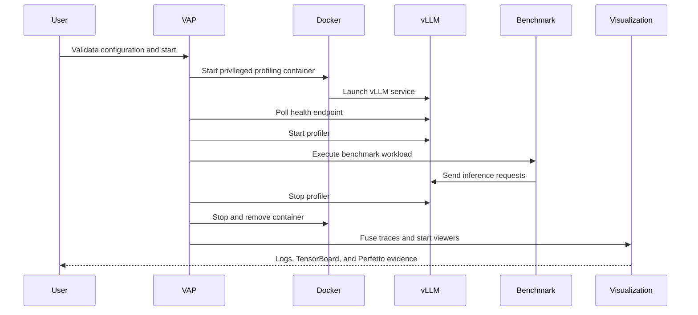

# VAP

<div class="vap-hero" markdown>

{ .vap-banner }

<p class="vap-kicker">vLLM profiling control plane</p>

## From model deployment to performance evidence

Configure, validate, benchmark, profile, and inspect a trusted vLLM workload
without stitching together a different script for every stage.

[Open the User Guide](user-guide.md){ .md-button .md-button--primary }
[Web UI Reference](ui.md){ .md-button }
[Agent and Skills](agent.md){ .md-button }
[Deployment and Architecture](deployment.md){ .md-button }

</div>

<div class="grid cards" markdown>

-   **What is VAP?**

    A lightweight control plane for deploying vLLM, running repeatable
    benchmarks, collecting Torch Profiler traces, and opening the results in
    TensorBoard or Perfetto.

-   **Why use it?**

    It replaces a fragile sequence of Docker, vLLM, benchmark, profiler, log,
    and visualization commands with one validated workflow and one run record.

-   **How do I use it?**

    Install VAP, open the token-protected Web UI, configure a trusted model and
    image, validate the environment, then run and inspect the generated evidence.

</div>

---

## What VAP Does

VAP is designed for engineers who need evidence from real vLLM workloads rather
than a one-off service launch. It coordinates the full profiling lifecycle while
keeping configuration, logs, and trace artifacts together.



## Why VAP Exists

<div class="grid cards" markdown>

-   **Repeatable runs**

    Every run receives an immutable configuration snapshot and timestamped log
    directory.

-   **Early failure**

    Ports, paths, images, devices, mounts, CLI arguments, and security-sensitive
    options are checked before an expensive profiling run.

-   **One evidence path**

    Deployment logs, benchmark logs, profiler traces, merged rank timelines,
    TensorBoard, and Perfetto all refer to the same run.

-   **Controlled automation**

    The optional Agent can inspect and explain state, while start and stop actions
    still require explicit approval.

</div>

## How a Run Works



## Quick Start

Install or update:

```bash
curl -fsSL https://raw.githubusercontent.com/Shan2L/VAP/main/bootstrap.sh | bash
```

Start VAP:

```bash
~/.local/bin/vap start
```

The service binds to `0.0.0.0:8899` by default and prints tokenized local,
hostname, and LAN IP candidates. Open a candidate that is reachable from your
trusted network.

!!! warning "Security boundary"

    VAP uses host networking, ROCm devices, and elevated Docker capabilities for
    profiling. The Web UI requires a session token but does not provide TLS.
    Run only trusted images, models, and configurations. Use
    `--host 127.0.0.1` with an SSH tunnel on untrusted networks.

## Choose the Right Document

- Start with the [User Guide](user-guide.md) for installation, configuration,
  Web UI, CLI, Agent usage, outputs, and troubleshooting.
- Use the [Web UI Reference](ui.md) for every panel, toolbar action, button
  state, log area, and Agent control.
- Read [Agent and Skills](agent.md) for the reasoning layer, tool safety model,
  approval flow, and TorchProfilerTraceSkill.
- Use the [Deployment and Technical Report](deployment.md) for architecture,
  security boundaries, systemd operation, lifecycle behavior, and production
  readiness.
- Review [Third-Party Notices](THIRD_PARTY_NOTICES.md) for attribution and
  license information.
